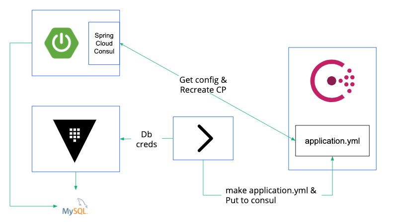

# Dynamic Connection Pool Re-creation with Vault Creds Rotation

This demo shows how to re-create JDBC Connection Pool with new credentials dynamically generated by Vault.



`application.yml` is stored in Consul KV and injected to the application as Configuration by Consul Config and Spring Cloud Consul. 

* Example of the `application.yml` in consul KV

```yaml
spring:
  application:
    name: vault-creds-fs-demoapp
  datasource:
    password: A1a-1mW71ypNrgEoFULd
    username: v-role-VCX86BrdS
    url: jdbc:mysql://127.0.0.1:3306/handson?useSSL=false
    driver-class-name: com.mysql.jdbc.Driver
    hikari:
      max-lifetime: 30000
      connection-timeout: 300
management:
  endpoints:
    web:
      exposure:
        include: "*"
```

* Example of `bootstrap.yml` to get the config file from Consul KV.

## Pre-requisite
* running Consul by default configuration
* running MySQL
* setting Vault DB Secret Engine

```shell script
$ vault secrets enable database;
$ vault write database/roles/role-handson \
  db_name=mysql-handson-db \
  creation_statements="CREATE USER '{{name}}'@'%' IDENTIFIED BY '{{password}}';GRANT SELECT,INSERT,UPDATE ON handson.users TO '{{name}}'@'%';" \
  default_ttl="5h" \
  max_ttl="5h"

$ vault write database/config/mysql-handson-db 
  plugin_name=mysql-legacy-database-plugin \
  connection_url="{{username}}:{{password}}@tcp(127.0.0.1:3306)/" \
  allowed_roles="role-demoapp" \
  username="root" \
  password="rooooot"
```

* create table
```sql
create table users_tokenization (id varchar(50), username varchar(50), password varchar(200), email varchar(200), creditcard varchar(200), flag varchar(30));
```

## How to demo

```shell script
$ ./mvnw clean package -DskipTests 
$ java -jar target/vault-creds-fs-demo-0.0.1-SNAPSHOT.jar
```

```shell script
$ curl 127.0.0.1:8080//api/v1/get-all-users | jq  
  [
    {
      "id": "5563de8d-fea8-46d8-91fb-a1fe87cda251",
      "username": "user-1",
      "password": "vault:v1:5jcLjcj2fJ1yNKjtbT+jKnK4dm4oyk/M6SzyjDO9tPlsQ83y",
      "email": "vault:v1:ubmPWH5rWrBf6EvDeOm0OyEe6GxSZHk6XjXxoxiB0PB621WWRp5WciFWPnC8",
      "creditcard": "vault:v1:BrDTpLG80jIVOaKDcka/fUbkkVritrd80YlM3WZFFsBBKHTHrlC2h/6twjX9CEw=",
      "flag": "transit"
    },
    {
      "id": "0af1cae3-a547-43c0-9255-b374b912856f",
      "username": "user-2",
      "password": "vault:v1:odhoji3/zrzXQssEbyawKiJi157Ypqwp+SEsx+nVp/TRyJoM",
      "email": "e4V0K@kabuctl.run",
      "creditcard": "HS0Q-8NAT-65MH-D1PQ",
      "flag": "simple-transformation"
    },
    {
      "id": "b06a78b1-1669-409b-b4d1-824b25037959f",
      "username": "user-3",
      "password": "vault:v1:K2UHGhbesPmN/AChSePnkaqWp0jXEKt+Aa3sDF0DguqLe/6x",
      "email": "e4V0K@kabuctl.run",
      "creditcard": "5346-4702-7668-7677",
      "flag": "simplest-transformation"
    },
    {
      "id": "185ab51a-e5c4-449d-b690-b8a3f3770a77",
      "username": "user-4",
      "password": "vault:v1:ItkCDPMKortEAZpNHZfaaLy9N0nQQ6SNahh9Sl0uYJZJfOqK",
      "email": "eaRV5tdF3xwu@2nsi4o7.QrJ",
      "creditcard": "H+Pz-Y8cE-e,j8-s8D~",
      "flag": "transformation"
    }
  ]
```

```shell script
$ ./update-config.sh
```

This script will
* generate new mysql creds and store to file
* make the new application.yml with new creds
* update application.yml to Consul KV
* revoke old mysql creds

make sure 
* consul kv is updated.
* The app log output connection pool is recreated.
* the old creds in mysql.json.backup is invalid by trying login to MySQL

After Configuration is updated in Consul KV, refresh event is published to application and this app will recreate connection pool using new configuration

refer: 
* [Spring Cloud Config](https://cloud.spring.io/spring-cloud-consul/reference/html/#spring-cloud-consul-config) 
